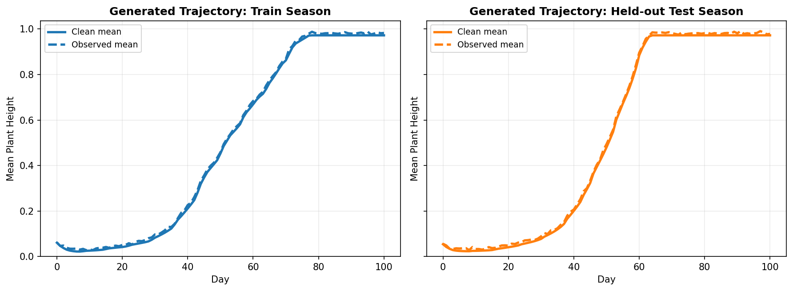
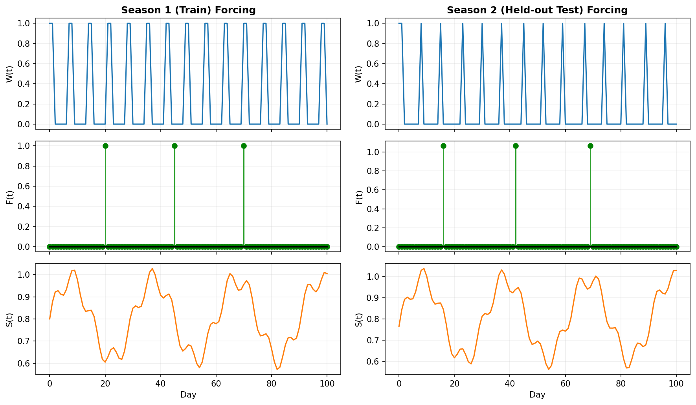
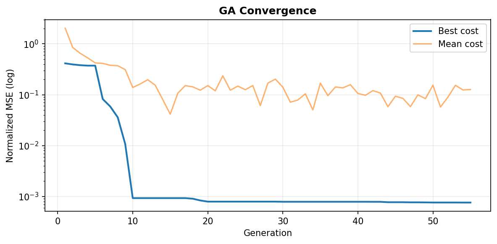
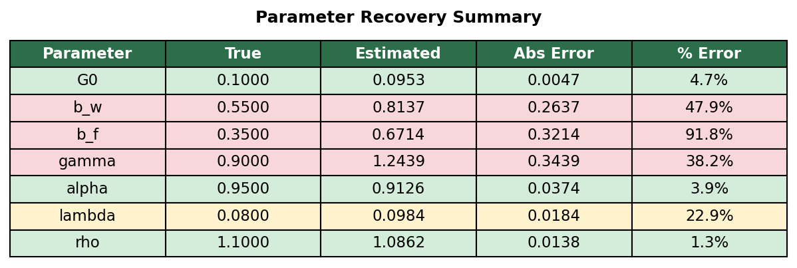
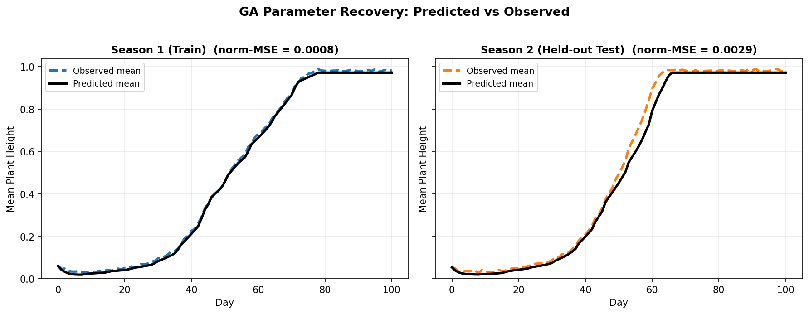
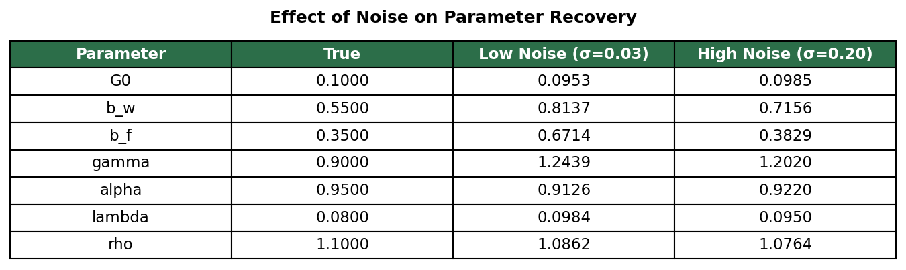

# Project 8: Nonlinear System Identification for a Crop Field Digital-Twin

**ME 144/244 — Modeling, Simulation, and Digital Twins of Drone-Based Systems**  
UC Berkeley · Spring 2026

---

## Overview

This project implements a **nonlinear system identification** pipeline for a crop-field digital twin. A genetic algorithm (GA) recovers the physical parameters of a plant-growth ODE model from noisy, synthetic observations — mimicking the kind of parameter inference a drone-mounted sensing system would perform over a growing season.

### Plant Growth Model

Each plant's height $h_i$ evolves as:

$$\frac{dh_i}{dt} = G(\mathbf{u})\, h_i^\alpha - \sum_{j \neq i} \lambda\, h_j \cdot e^{-r_{ij}/\rho} \cdot \mathbf{1}\{r_{ij} \leq \rho\}$$

$$G(\mathbf{u}) = G_0\,(1 + \beta_w w + \beta_f f)\, s^\gamma$$

**Free parameters:** $\alpha,\, \lambda,\, \rho,\, G_0,\, \beta_w,\, \beta_f,\, \gamma$

**Inputs:** $w$ = irrigation (burst), $f$ = fertilizer (step), $s$ = solar irradiance (sinusoidal)

---

## Results

### Synthetic Data — Train & Test Seasons

Two independent growing seasons generated with different forcing inputs.  
Clean signal (solid) vs. noisy observations (dashed) overlap almost perfectly at $\sigma = 0.03$.



---

### Seasonal Forcing Inputs

Water, fertilizer, and solar irradiance signals for both seasons.



---

### GA Convergence

Best cost drops 3 orders of magnitude within the first 10 generations.



---

### Parameter Recovery

| Color | Meaning |
|-------|---------|
| 🟢 Green | < 10% error — well identified |
| 🟡 Yellow | 10–35% error — moderate |
| 🔴 Red | > 35% error — poorly identified |



**Structural parameters** ($\alpha$, $\rho$) are recovered accurately.  
**Forcing sensitivity parameters** ($\beta_w$, $\beta_f$, $\gamma$) are poorly identified due to **partial unidentifiability** — different combinations of these three produce nearly identical effective growth rates $G(\mathbf{u})$.

---

### Predicted vs. Observed Trajectories

Despite imperfect parameter recovery, the model captures the **mean growth trajectory** well on both the training season and the completely unseen held-out test season.



| Set | Normalized MSE |
|-----|---------------|
| Train (Season 1) | 0.0008 |
| Test (Season 2, held-out) | 0.0029 |

---

### Effect of Observation Noise on Parameter Recovery

Increasing `noise_sigma` from 0.03 → 0.20. Per the TA note on Ed Discussion, the normalized MSE cost is inherently robust to noise level (numerator and denominator both scale with $\sigma^2$), but individual parameter estimates degrade.



---

## Repository Structure

```
Project 8/
├── Code/
│   ├── plantga/
│   │   ├── simulation.py        # Plant growth ODE + Euler integrator
│   │   ├── genetic_algorithm.py # GA estimator + normalized MSE objective
│   │   └── data_generation.py   # Synthetic dataset generation
│   ├── write_parameters.py      # Default parameter config
│   ├── main.ipynb               # Main notebook (deliverables)
│   └── generate_results.py      # Script to regenerate all figures
├── animations/                  # Output figures
├── student_template.tex         # LaTeX report template
└── ME144_244_sp26_Project8.pdf  # Assignment handout
```

## Setup

```bash
pip install numpy matplotlib
cd Code
python write_parameters.py   # generate parameters.pkl
jupyter notebook main.ipynb  # run the assignment notebook
```
